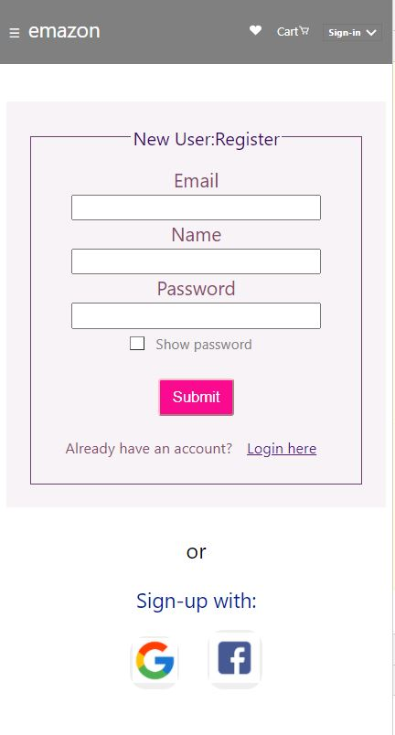

## emazon-A complete shopper website
###### (*using mern stack*)

## General info
This project is a responsive e-commerce website suitable for all screen size

## Technologies used
* CSS
* JS
* MongoDB
* Express Js
* React Js
* Node Js

### Features
* Fully complete website
* Responsive website
* Login as admin
* Can add products to sell (as admin)
* Edit those products
* Sign up for new user
* Login as user
* Social Login 
* Forgot Password 
* Reset Password
* Search Products
* Sort products
* Filter products
* Shopping Categories
* Account Management
* Edit Profile
* Add addresses
* Manage addesses
* Whishlist products
* Delete wishlisted products , can add them to cart
* Add to cart
* Previous Orders
* Checkout
* Different payment options
* Contact-us

### Demo

https://emazon-l.herokuapp.com/    

To login as a Admin : email: admin@gmail.com , password:admin

  ##### Mobile View  

  ##### Mobile View  

   

  ##### Mobile View  

##### Mobile View  

##### Mobile View  

#### Admin Portal

  ##### Mobile View   

